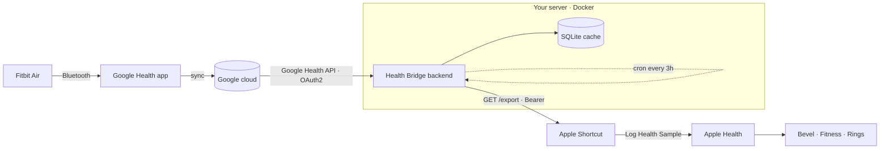
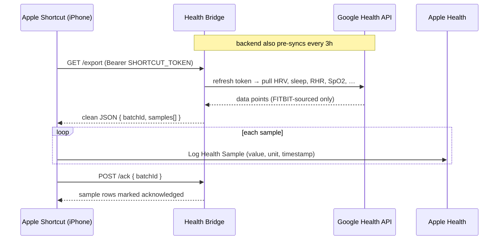

<div align="center">

# 🌉 Health Bridge

**Sync your Fitbit data — including full HRV — from the Google Health API into Apple Health.**

Built for the Fitbit Air era, where the Google Health app reads *from* Apple Health but won't write your Fitbit data *back*. Health Bridge closes that gap with a tiny self‑hosted service and one Apple Shortcut.


</div>

---

## The problem

The new **Google Health** app (which replaced Fitbit in May 2026) will happily *read* your iPhone's Apple Health data — but as of now it does **not write your Fitbit data back into Apple Health**. Off‑the‑shelf Fitbit→Apple sync apps exist, but none carry **HRV**, the metric recovery apps like Bevel care about most.

**Health Bridge** pulls your Fitbit data straight from the official **Google Health API** (the successor to the Fitbit Web API), caches it in a small service you host, and exposes a clean JSON feed that an **Apple Shortcut** writes into Apple Health on a daily automation. No App Store app, no Apple Developer Program fee.

## How it works



A daily run looks like this:



## What gets synced

All field paths below were **verified against the live Google Health API**.

| Metric | Apple Health type | Source field |
|---|---|---|
| ❤️ **HRV — full intraday series** (~every 5 min) | Heart Rate Variability (SDNN) | `heartRateVariability.rootMeanSquareOfSuccessiveDifferencesMilliseconds` |
| ❤️ HRV nightly average *(fallback)* | Heart Rate Variability | `dailyHeartRateVariability.averageHeartRateVariabilityMilliseconds` |
| 💓 Resting heart rate | Resting Heart Rate | `dailyRestingHeartRate.beatsPerMinute` |
| 🫁 Blood oxygen (SpO₂) | Blood Oxygen Saturation | `dailyOxygenSaturation.averagePercentage` |
| 🌬️ Respiratory rate | Respiratory Rate | `dailyRespiratoryRate.breathsPerMinute` |
| 🏃 VO₂ max | VO₂ Max | `dailyVo2Max.vo2Max` |
| 😴 Sleep + stages | Sleep Analysis | `sleep.stages[]` (AWAKE / LIGHT / DEEP / REM) |
| ❤️ Continuous heart rate *(activity/cardio)* | Heart Rate | `heartRate.beatsPerMinute` |
| 🔥 Active energy *(activity/cardio)* | Active Energy | `activeEnergyBurned.kcal` |
| 🏋️ Workouts *(activity/cardio)* | Workouts | `exercise.interval` + `exercise.metricsSummary` |
| 👟 Steps · distance · floors *(activity/cardio)* | Steps · Distance · Flights Climbed | `steps.count` · `distance.millimeters` · `floors.count` |

## Design notes (the non‑obvious bits)

- **All HRV, not just a number.** The full intraday HRV series is written at each reading's real timestamp; the nightly average is only used for dates with no granular samples — so nothing's missed and nothing's double‑written.
- **Source filtering.** The API returns both `FITBIT` and `HEALTH_KIT` data (because Google Health pulls *in* your Apple data). Health Bridge keeps only `FITBIT` points, so it never writes your Apple Watch's own data back into Apple Health.
- **`list` vs `:reconcile`.** Daily summaries come from `list`; sessions/intervals (`sleep`, `steps`, `distance`, `active-energy-burned`, `floors`, `exercise`) use `:reconcile`.
- **HRV units.** Fitbit reports HRV as RMSSD; Apple Health only has an SDNN field. The value is written into SDNN — perfect for tracking *your* trend, not comparable in absolute terms to an Apple Watch.
- **No duplicates.** Per-sample backend acknowledgements plus stable dedup keys mean re-running is safe, including when new metric types are added for already-synced dates.
- **Activity/cardio imports** can duplicate another watch/phone if both are writing the same day into Apple Health, so continuous heart rate, workouts, active energy, steps, distance, and floors are behind `SYNC_ACTIVITY` (set `0` to skip).

## Quick start

> Full, junior‑dev‑ready detail lives in [`docs/IMPLEMENTATION_SPEC.md`](docs/IMPLEMENTATION_SPEC.md).

### 1. Google Cloud / OAuth (one‑time)
- Create a project, **enable the Google Health API**.
- OAuth consent screen → **External**. Add the three read‑only scopes:
  `…/googlehealth.health_metrics_and_measurements.readonly`,
  `…/googlehealth.sleep.readonly`,
  `…/googlehealth.activity_and_fitness.readonly`.
- Add yourself as a **test user** (the Fitbit/Google account). Create a **Web application** OAuth client.
- 💡 Verify your data is reachable first with [`scripts/PHASE0_TEST.md`](scripts/PHASE0_TEST.md).

### 2. Configure & run
```bash
cp .env.example .env      # fill in client id/secret; generate tokens with: openssl rand -hex 32
npm install
npm run dev               # or: npm run build && npm start
```

### 3. Deploy (Dokploy / any Docker host)
- Point a subdomain at the host, deploy the included `docker-compose.yml`, mount a volume at `/data`, enable HTTPS.
- Visit `https://your-domain/auth/start?admin=ADMIN_TOKEN` once and grant access.
- `curl -X POST https://your-domain/sync -H "Authorization: Bearer SHORTCUT_TOKEN"` → `{ "added": N }`.

### 4. The iPhone Shortcut
Build the "Sync Google Health → Apple Health" Shortcut and turn on a daily automation — step‑by‑step in [`shortcut/SHORTCUT_GUIDE.md`](shortcut/SHORTCUT_GUIDE.md).

## API

| Method | Path | Auth | Purpose |
|---|---|---|---|
| `GET` | `/healthz` | — | liveness + authorized flag |
| `GET` | `/auth/start?admin=…` | admin token | begin OAuth consent (one‑time) |
| `GET` | `/auth/callback` | (Google) | OAuth redirect target |
| `GET` | `/export` | Bearer | unsynced samples + `batchId` |
| `POST` | `/ack` | Bearer | mark exported sample rows acknowledged |
| `POST` | `/sync` | Bearer | trigger a fetch from Google |
| `POST` | `/webhooks/google-health` | Bearer | future: push on new sleep data |

## Configuration

| Variable | Default | Notes |
|---|---|---|
| `PUBLIC_BASE_URL` | — | your deployed URL |
| `GOOGLE_CLIENT_ID` / `GOOGLE_CLIENT_SECRET` | — | from Google Cloud |
| `GOOGLE_REDIRECT_URI` | — | `…/auth/callback` (or the OAuth Playground while testing) |
| `GOOGLE_SCOPES` | — | the three read‑only Health scopes |
| `SHORTCUT_TOKEN` / `ADMIN_TOKEN` | — | `openssl rand -hex 32` |
| `USER_TZ` | `Europe/London` | buckets "civil days" + picks sleep midpoint |
| `LOOKBACK_DAYS` | `4` | how far back each sync re‑pulls |
| `SYNC_ACTIVITY` | `1` | continuous heart rate, workouts, active energy, steps, distance, floors — `0` to avoid double-counting |

## Repository layout

```
src/
  config.ts        env loading + validation
  db.ts            SQLite schema
  oauth.ts         OAuth bootstrap + token refresh
  googleHealth.ts  API client (list / listSince / reconcile)
  mapping.ts       Google data points → Apple Health samples  ← core logic
  sync.ts          fetch → normalize → upsert
  exporter.ts      /export + /ack (per-sample ack, dedup-safe)
  scheduler.ts     cron (every 3h)
  server.ts        Fastify routes
docs/IMPLEMENTATION_SPEC.md   full build spec
shortcut/SHORTCUT_GUIDE.md    build the Apple Shortcut
scripts/PHASE0_TEST.md        confirm your data is reachable
```

## Limitations & roadmap

- **Restricted scopes.** Health scopes are "restricted"; an unverified app works for ≤100 users (perfect for personal use) but a long‑lived production token may require Google verification — otherwise re‑auth periodically.
- **Background timing.** Data appears after the Google Health app syncs the Air, so the Shortcut runs midday/evening rather than at dawn.
- **Roadmap:** swap polling for the Google Health API's webhook subscriptions (sleep trigger) + APNs push when they leave preview; optional menstrual/temperature metrics.

## Disclaimer & license

Not affiliated with Google, Fitbit, or Apple. "Fitbit", "Google Health", and "Apple Health" are trademarks of their respective owners. This project only reads your own data with your own OAuth credentials. Provided as‑is, no warranty.

Suggested license: **MIT** (add a `LICENSE` file).
