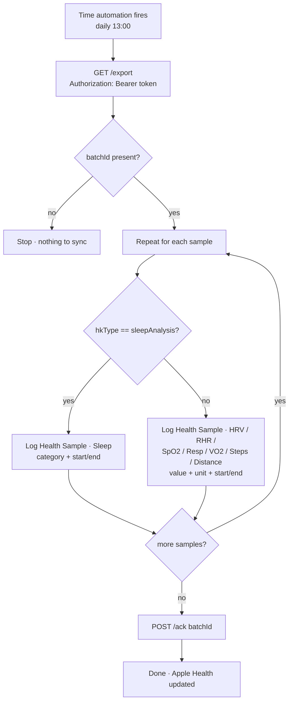

# Apple Shortcut — "Sync Google Health → Apple Health"

The Shortcut fetches the backend's `/export` JSON, loops over the samples, writes each
into Apple Health with its real timestamp, then calls `/ack`. Shortcuts is a normal app,
so this needs **no developer account and no HealthKit entitlement**.

> **Why there's no one‑click import file:** a `.shortcut` file is a signed/encoded plist,
> and a hand‑authored one with HTTP + JSON parsing + a per‑type logging loop is unreliable
> to import. Building it in the Shortcuts app (≈15 min, once) is the dependable route. If
> you'd rather, the repo owner can walk you through it live on screen.

### What the Shortcut does

## Variables to set first

Add two **Text** actions at the very top:
- `Token` = your `SHORTCUT_TOKEN`
- `BaseURL` = `https://health-bridge.yourdomain.com`

## Action list

1. **Text** → (your token). Rename the output variable to **Token**.
2. **Text** → `https://health-bridge.yourdomain.com`. Rename to **BaseURL**.
3. **Get Contents of URL**
   - URL: `BaseURL` `/export`  (concatenate: type BaseURL variable then `/export`)
   - Method: **GET**
   - Headers: `Authorization` → `Bearer ` + `Token`
4. **Get Dictionary Value** → Get **Value** for key `batchId` from *Contents of URL*. Rename to **BatchId**.
5. **Get Dictionary Value** → Get **Value** for key `samples` from *Contents of URL*. Rename to **Samples**.
6. **If** `BatchId` **has any value** … (everything below goes inside the If; the Otherwise branch can just stop).
7. **Repeat with Each** item in `Samples`:
   1. **Get Dictionary Value** `hkType` (→ **HK**)
   2. **Get Dictionary Value** `category` (→ **Cat**)
   3. **Get Dictionary Value** `value` (→ **Val**)
   4. **Get Dictionary Value** `start` (→ **Start**)
   5. **Get Dictionary Value** `end` (→ **End**)
   6. **If** `HK` **is** `sleepAnalysis`:
      - **Log Health Sample** → Sample Type: **Sleep**; State/Value: from **Cat**
        (maps to In Bed / Asleep (Core) / Asleep (Deep) / Asleep (REM) / Awake);
        Start Date: **Start**; End Date: **End**.
      - *(In the Log Health Sample picker, sleep value options are chosen in the action.
        Use an inner If/Otherwise on `Cat` if your iOS build needs the value hardcoded
        per branch — see "Sleep detail" below.)*
   7. **Otherwise** → an **If / Otherwise** chain on `HK`, one **Log Health Sample** per type:
      - `heartRateVariabilitySDNN` → Type **Heart Rate Variability**, Value **Val** (ms), Start **Start**, End **End**
      - `restingHeartRate` → Type **Resting Heart Rate**, Value **Val**, dates **Start/End**
      - `oxygenSaturation` → Type **Blood Oxygen Saturation**, Value **Val** (%), dates **Start/End**
      - `respiratoryRate` → Type **Respiratory Rate**, Value **Val**, dates **Start/End**
      - `vo2Max` → Type **VO₂ Max**, Value **Val**, dates **Start/End**
      - `stepCount` → Type **Steps**, Value **Val**, dates **Start/End**
      - `distanceWalkingRunning` → Type **Walking + Running Distance**, Value **Val** (m), dates **Start/End**
      - `activeEnergyBurned` → Type **Active Energy**, Value **Val** (kcal), dates **Start/End**
8. **(after the Repeat)** **Get Contents of URL**
   - URL: `BaseURL` `/ack`
   - Method: **POST**
   - Request Body: **JSON** → key `batchId` = **BatchId**
   - Headers: `Authorization` → `Bearer ` + `Token`

## Grant Health write permission (one-time)

Run the Shortcut manually once. iOS will prompt to allow writing to Health — **Turn All
On**. If a particular type's permission doesn't appear, it's because Shortcuts hasn't
tried to write it yet: let the Shortcut run (it may fail on that type), then enable it
under **Health app → your profile → Privacy → Apps → Shortcuts**, and run again.

## Automate it

Shortcuts → **Automation** tab → **＋ → Create Personal Automation → Time of Day**:
- Time: **13:00**, Repeat: **Daily** (afternoon, so the Google Health app has already
  synced the night's data).
- Action: **Run Shortcut → Sync Google Health → Apple Health**.
- **Turn OFF "Ask Before Running" → Don't Ask.**
- Optionally add a second automation at **21:00** for resilience.

## Sleep detail (the fiddly bit)

`/export` returns sleep as one sample per stage segment (`category` = `asleepCore` /
`asleepDeep` / `asleepREM` / `awake`). The cleanest implementation is an inner
**If/Otherwise on `Cat`** with one **Log Health Sample → Sleep** action per stage value,
each fed **Start**/**End**. If staging proves flaky on your iOS version, simplify the
backend to emit a single nightly `asleepUnspecified` block (it already falls back to this
when no stages are present) and log just that.

## Verify

After a manual run: open **Apple Health** → check Heart Rate Variability, Resting Heart
Rate, Blood Oxygen, Respiratory Rate, and Sleep show entries at the right times → open
**Bevel** and confirm it ingests them. Run the Shortcut a second time immediately — it
should add nothing (the cursor advanced on `/ack`).
